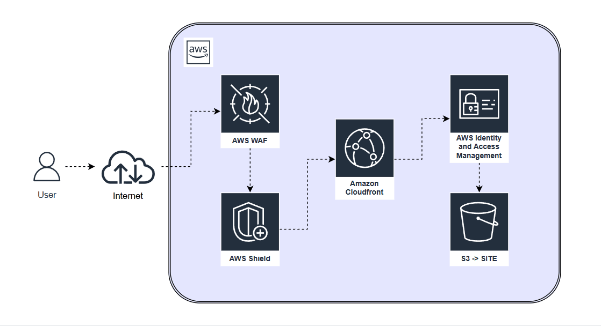
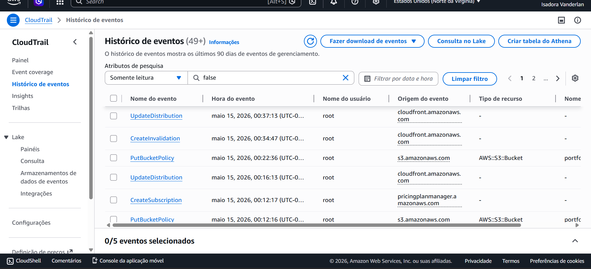

### Site Portifolio Cloud Security - Isadora Vanderlan

 

---

# 📝 Descrição do Projeto

Este é o meu portfólio profissional focado em **Cloud Security**. O objetivo deste espaço é centralizar e demonstrar minhas competências técnicas na proteção de ambientes em nuvem, governança e arquitetura segura.

O projeto foi estruturado com uma navegação fluida e divide-se nas seguintes seções:

- **🛡️ Cloud Security:** Controles de segurança, políticas IAM e proteção de dados implementados.
- **🏗️ Architecture:** Diagramas da implementação deste site no Cloud AWS.
- **🛠️ Infrastructure:** Recursos utilizados e engenharia de infraestrutura de nuvem.
- **🏆 Certifications:** Minhas conquistas e validações oficiais do mercado.
- **📬 Contact:** Meus canais de comunicação abertos para conexões profissionais e oportunidades.

 

---

# 🔗 Link para o Site no AWS CloudFront

  <a href="dlj4pdyu1fq4u.cloudfront.net" target="_blank">Clique aqui para acessar o site</a>

    
  </a>

 

---

# 🏗️ Arquitetura de Nuvem Segura

O site é hospedado de forma 100% segura na AWS, seguindo as melhores práticas do CIS Benchmarks e o pilar de segurança do AWS Well-Architected Framework.

<table>
  <tr>
    <td style="background: #1a1a1a; border: 1px solid #333; border-radius: 8px; padding: 4px;">
      
    </td>
  </tr>
</table>

**Fluxo da Requisição:**
Usuário ➔ DNS Route 53 ➔ Edge Security (AWS Shield & AWS WAF) ➔ AWS CloudFront (HTTPS/TLS) ➔ IAM (Origin Access Control) ➔ S3 Bucket (Privado).

 

---

# 🛡️ Controles de Segurança Implementados (Cloud Security)

### 1. Proteção do Armazenamento (Amazon S3)

- **Bloqueio de Acesso Público (BPA):** Ativado globalmente no bucket para evitar vazamento de dados acidental.
- **Criptografia em Repouso:** Implementada criptografia Server-Side (SSE-S3) com chaves gerenciadas.
- **Versionamento de Objetos:** Ativado para proteção contra exclusões acidentais ou ataques de ransomware.
- **Acesso Privado Restrito:** O acesso direto ao bucket via HTTP é totalmente bloqueado. O conteúdo só é acessível através do CloudFront.

### 2. Entrega Segura de Conteúdo (AWS CloudFront)

- **Origin Access Control (OAC):** Configurado para que o CloudFront assine digitalmente as requisições enviadas ao S3, garantindo que o bucket só responda à CDN.
- **Políticas de Segurança TLS:** Configurado para aceitar apenas conexões seguras via HTTPS (TLS 1.2/1.3).
- **Security Headers (Políticas de Resposta):** Implementação de cabeçalhos de segurança estritos para mitigar ataques comuns de web:
  - `Strict-Transport-Security` (HSTS)
  - `Content-Security-Policy` (CSP)
  - `X-Frame-Options` (Prevenção de Clickjacking)
  - `X-Content-Type-Options` (Prevenção de MIME-sniffing)

### 3. Governança, Auditoria e Logs (AWS CloudTrail & S3 Server Access Logs)

- **Trilha de Auditoria (CloudTrail):** Ativado para registrar todas as chamadas de API na conta AWS, monitorando criações, alterações e deleções de recursos.
- **Logs de Acesso do CloudFront:** Direcionados para um bucket de logs dedicado e isolado para análise de tráfego malicioso.

 

---

# 📊 Auditoria do AWS CloudTrail

 

---

# 🎨 Interface e Front-end

- **Desenvolvimento Nativo:** Construído com HTML5 estrutural e CSS3 puro (Flexbox/Grid), sem uso de frameworks pesados para otimização de performance.
- **Design Responsivo:** Layout fluido e adaptável para múltiplos dispositivos e tamanhos de tela utilizando funções modernas de CSS como `clamp()`.
- **Identidade Visual:** Interface moderna com estética Glassmorphism, efeitos fluídos de profundidade e tipografia otimizada digitalmente.

 

---

# 📬 Meu Contato

- **LinkedIn:** [Isadora Vanderlan](https://www.linkedin.com/in/isadoravanderlan/)
- **E-mail:** vanderlansantos1991@gmail.com
